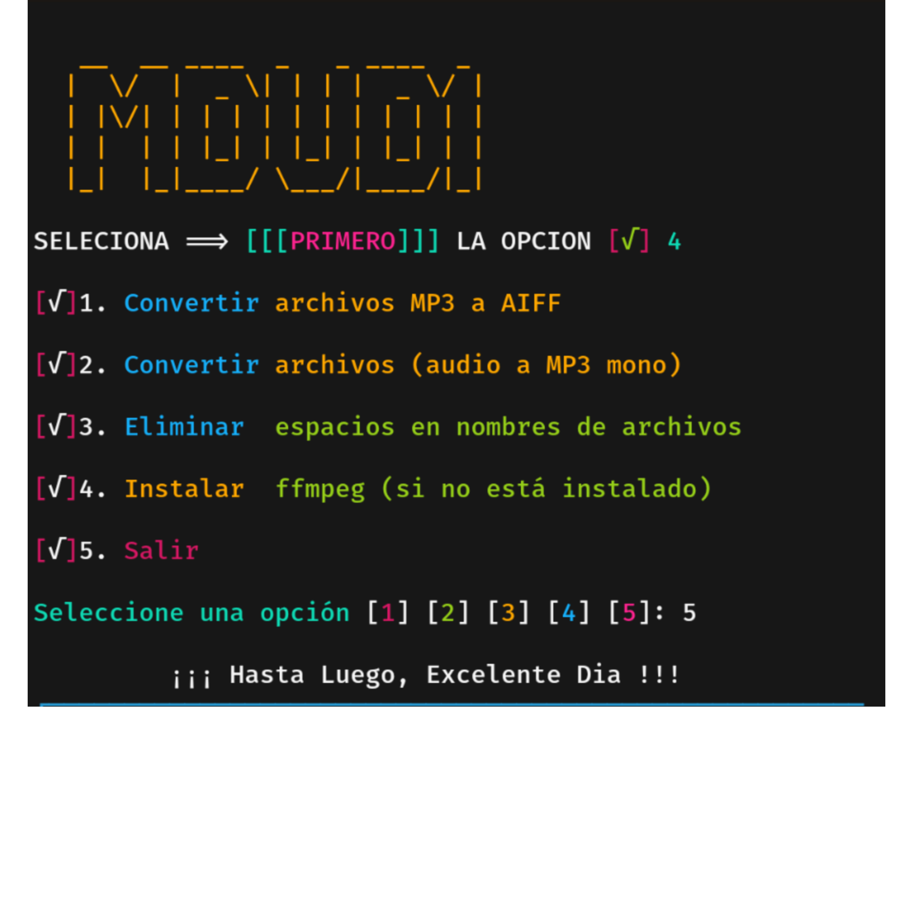

## FUNCIONES DISPONIBLES 


### * Convertir archivos MP3 a AIFF
* Esta función convierte archivos MP3 en AIFF y guarda los resultados en el mismo directorio. 

### 2. Convertir archivos de audio a MP3 mono
* Esta función convierte archivos de audio (MP3, WAV, FLAC, OGG) en archivos MP3 mono y guarda los resultados en el mismo directorio

### 3. Eliminar espacios vacios en nombres de archivos
* Esta función renombra archivos en el directorio actual, reemplazando los espacios en blanco con guiones bajos "_".

### 4. Instalar ffmpeg (si no está instalado)
* Esta función verifica si `ffmpeg` está instalado. Si no lo está, lo instala automáticamente

## Instrucciones de uso

* clona el repositorio con este comando
```
git clone https://github.com/Retired64/Audio_Tools64.git
```
* despues dirigete a la carpeta clonada con ` cd Audio_Tools64 ` para despues darle permiso de ejecucion al archivo
```
cd Audio_Tools64
```
```
chmod 777 Audio64Tools.sh
```
* ejecuta el archivo para ver sus funciones con el siguiente comando
```
bash Audio64Tools.sh
```
* entraras al menu para elegir tus opciones segun tus necesidades
* DATO IMPORTANTE
Tendras que mover los audios a la carpeta donde te ecuentras con el programa y despues ejecutar el programa como ya se te menciona que se ejecuta asi ` bash Audio64Tools.sh`
ejemplo del comando de como copiar tus audios a la carpeta actual del programa
```
cp -r /sdcard/donde_estan_tus_audios/* .
```
asi ejecutaras y pondras los audios que deseas modificar en la ruta actual del programa ahora si disfruta :)

### EXTRAS 

LOS AUDIOS A FORMATEAR DEBERAN ESTAR EN LA CARPETA DONDE ESTARA ESTE  ` Audio64Tools.sh ` y aqui mismo se guardaran los nuevos ` .mp3 MONO ` 
PARA DESPUES FORMATEARLOS A .AIFF Y AHORA SI PODER REEMPLAZARLOS POR LOS ARCHIVOS DE TU JUEGO 

